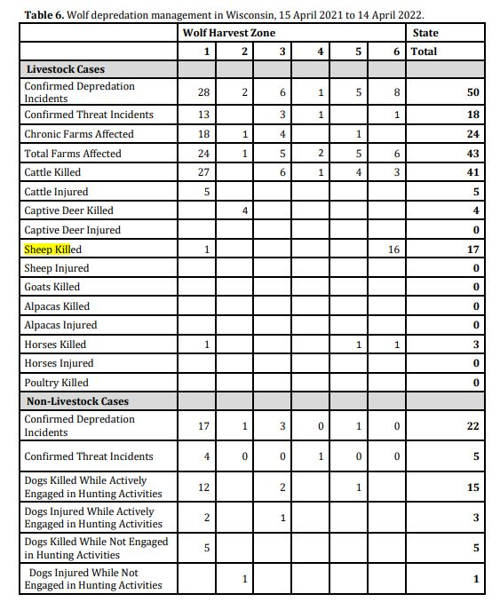
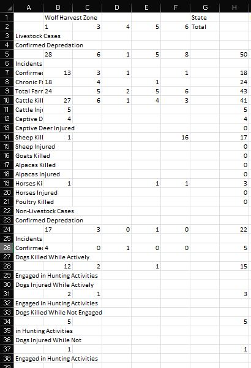
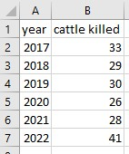
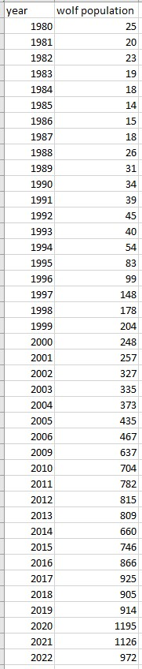
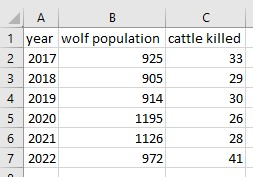

## Data Processing Walkthrough and Example 

## Background and Use Case
- The data used in the Wisconsin Wolf Analysis mostly came from tables in PDF documents.
- Using the python package Camelot, we constructed a script that parses through given PDF file(s) and outputs CSVs in subfolders, extract data of interest from those csv files, and combine csv files for easy use in the statistics testing package.
- This document will help those with limited coding experience use this tool.

## Before Use

- Install all the required packages information in **doc/developer.md**
- The data processing script is located within the **WisconsinWolfAnalysis/data** folder.
- Download the PDF file(s) you want to extract data from and add them into the same directory.
- Activate the `wolf_env` virtual environment by running `conda activate wolf_env` from the git repository in the command line. 

## How to Use

- Import the scripts you want to use within the data subpackage (in a text document or IDE). An example import statement you could use (for a script in the WisconsinWolfAnalysis directory) is: `from data.data_processing import (pdf_parser, data_extractor, combine_csv_files)`
- Scroll to the bottom of the file and create a new variable like so
`PDF_LIST = [‘YOUR_PDF_FILE_NAME.pdf’, ‘OTHER_PDF_NAME.pdf’]`
> **Note:** This list can contain a single element instead of multiple depending on how many files you want to parse.
- Then call the function within the python code like so
`pdf_parser(PDF_LIST, 'pdf/', False)`
>**Note:** This will send the extracted csv files to a new subfolder called **pdf**. The name of the folder can be whatever string you want it to be. The last input, "False" ensures warnings from the Camelot PDF extraction package are shown. If you'd like to supress them, you can switch it to "True"
- Run pdf_parser 
`pdf_parser(PDF_LIST, 'pdf/', False)`
>**Note:** Might need to use python3 instead of python depending on your specific installation 
- After running the pdf_parser, you'll have a folder for each pdf file in PDF_LIST, and each of those folders will have subfolders for data the program determined to be "good" or "bad", and csv files that had the same headers and were "merged".
- You may want to extract data from multiple csv files that have the same row name. This can be done with data_extractor. The function call for data_extractor is:
`data_extractor(PDF_LIST, row_label, output_label, output_file)`
-You'll likely use the same PDF_LIST you used for pdf_parser, but you could use a subset of that list if you only want to look in a subset of files. row_label is the label of the row you want to pull the total from. It is case sensitive and may be something like "Cattle Killed" or "Sheep Killed". The output label is the column name for this data in the output csv file. It can be the same as row label, but you may want to add a more descriptive name or change the case. The output_file is the where you want the file saved.
- Now that you have a csv file the same data across multiple files, you'll want to combine it with other datasets before proceeding to statistical analysis and plotting. This can be done with combine_csv_files. This program accepts two csv files, each with a column labeled "year", a column name from each file, and an output file path. It searches for all of the years that exist in both files, then combines those years and data from the specified columns into a new csv file. It is called like so
`combine_csv_files(csv_file_1, column_name_1, csv_file_2, column_name_2, output_file)`
 
## Example 
- This example came from running pdf parser on the pdf file **WolfReport2022.pdf**
`pdf_parser([WolfReport2022.pdf], 'pdf/', False)`
- Many csv files were created, here is single output from page 12 of the report:

- If you've run pdf_parser on multiple years of WolfReports and wanted to get the "Cattle Killed" value from each file without looking through all of the .csv files by hand, you could run the pdf_parser on multiple files, then run data_extractor:
`pdf_parser([WolfReport2017.pdf, WolfReport2018.pdf, WolfReport2019.pdf, WolfReport2020.pdf, WolfReport2021.pdf, WolfReport2022.pdf], 'pdf/', False)`

`data_extractor([WolfReport2017.pdf, WolfReport2018.pdf, WolfReport2019.pdf, WolfReport2020.pdf, WolfReport2021.pdf, WolfReport2022.pdf], 'Cattle Killed', 'cattle killed', 'yearly_cattle_killed.csv')`
These commands would produce the following file:

- To combine that with annual wolf population, use the combine_csv_files function. You can combine the cattle killed data with annual wolf population:

`combine_csv_files('wolf_population.csv', 'wolf population', 'yearly_cattle_killed.csv', 'cattle killed', 'example.csv')`

Which produces the following csv file

