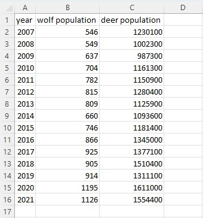
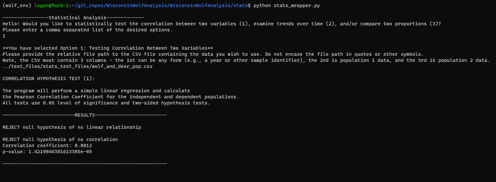
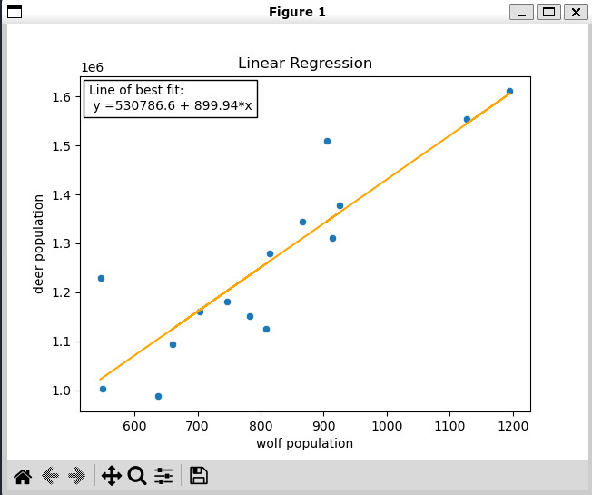

# Stats Module Walkthrough and Example

## Background and Use Case
- The stats module contains three functions that perform statistical tests
and/or plot data that were used to conduct the analyses documented in our final
report.
- This document will guide users who wish to run one or more of the functions
in the stats module.

## Before Use
- Install all the required packages information in **doc/development.md**
- Activate the `wolf_env` virtual environment by running `conda activate wolf_env` from the git repository in the command line. 

## How to Use
- There are two methods you can run the tool. 
   * To run it from the command line, navigate to the WisconsinWolfAnalysis repository in the terminal/command line. Then, navigate to **WisconsinWolfAnalysis/WisconsinWolfAnalysis/stats** and 
run the stats_wrapper.py file by typing `python stats_wrapper.py` and then press enter. 
   * Alternatively, when running the tool from outside of the stats module package, you can import the function by add `from stats.stats_wrapper import wrapper` to your code. Then you can call the wrapper function by writing `wrapper()` in your code.
 - Once you start the tool, follow the prompts. First the script will ask you to specify which of the three options you would like to perform. You can provide multiple as a comma-separated list, 
e.g. **1,2,3**. Provide the list of options and press `enter`. 
- Next, the script will ask you to provide a relative file path to a CSV file containing the data you wish to use. **Note, your CSV file must follow the format specifically required by the script**. Enter the filepath and press `enter`. 
- The script will then perform the requested action. It will print any statistical results to the terminal and plot any graphs in a separate pop-up window. 

## Example
Below are a series of images showing how to run the first option in the stats module via the command line. Here is the layout of the input CSV:

And here is the script dialogue and outputs:

